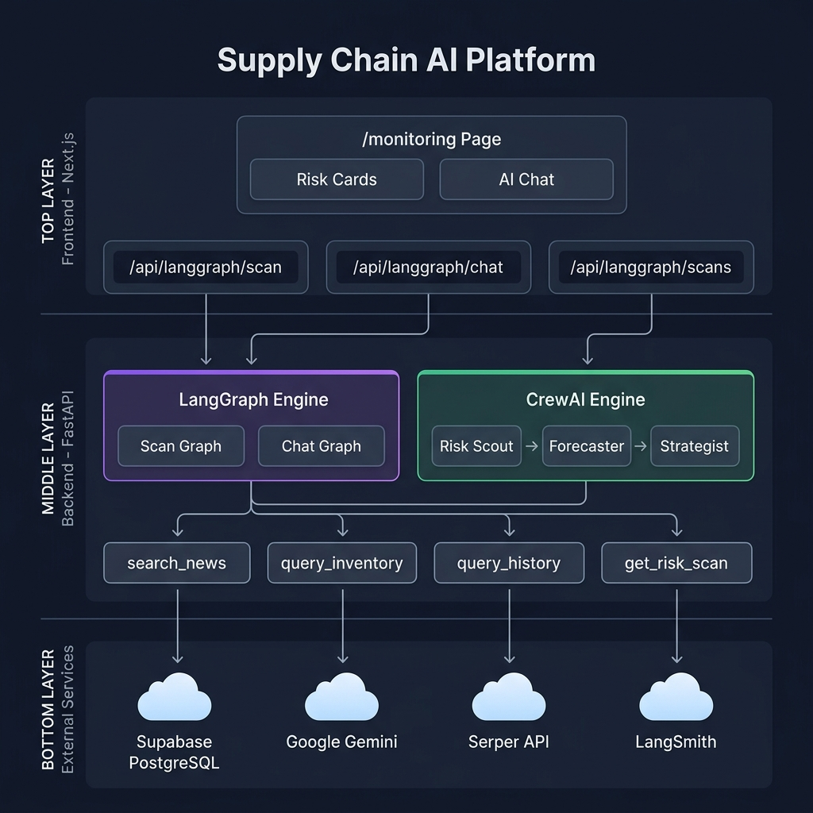
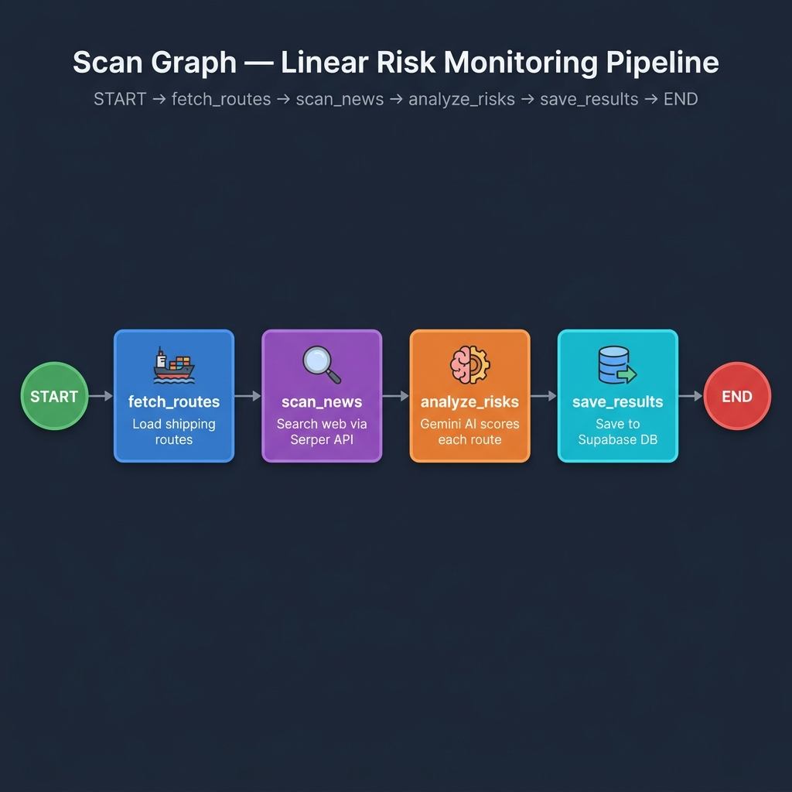
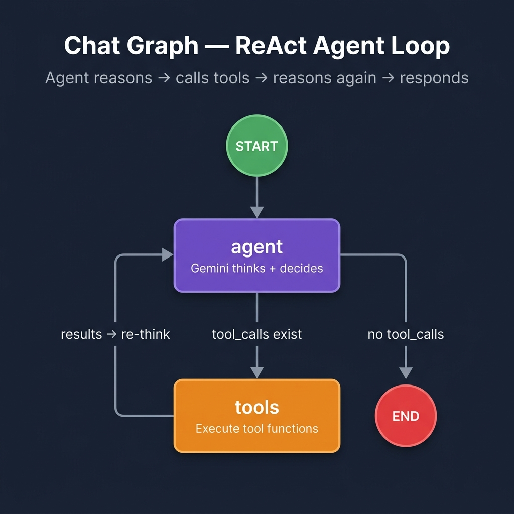
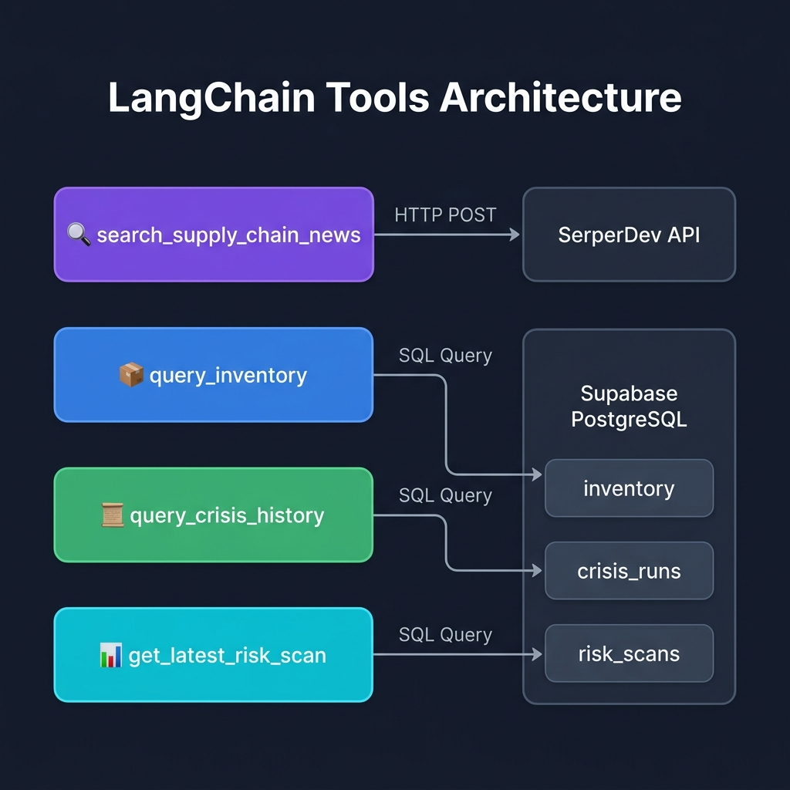
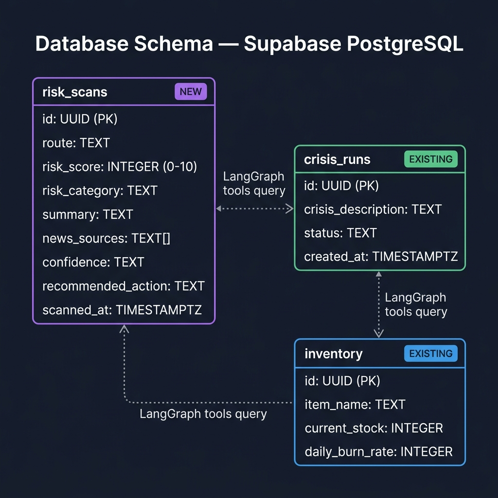
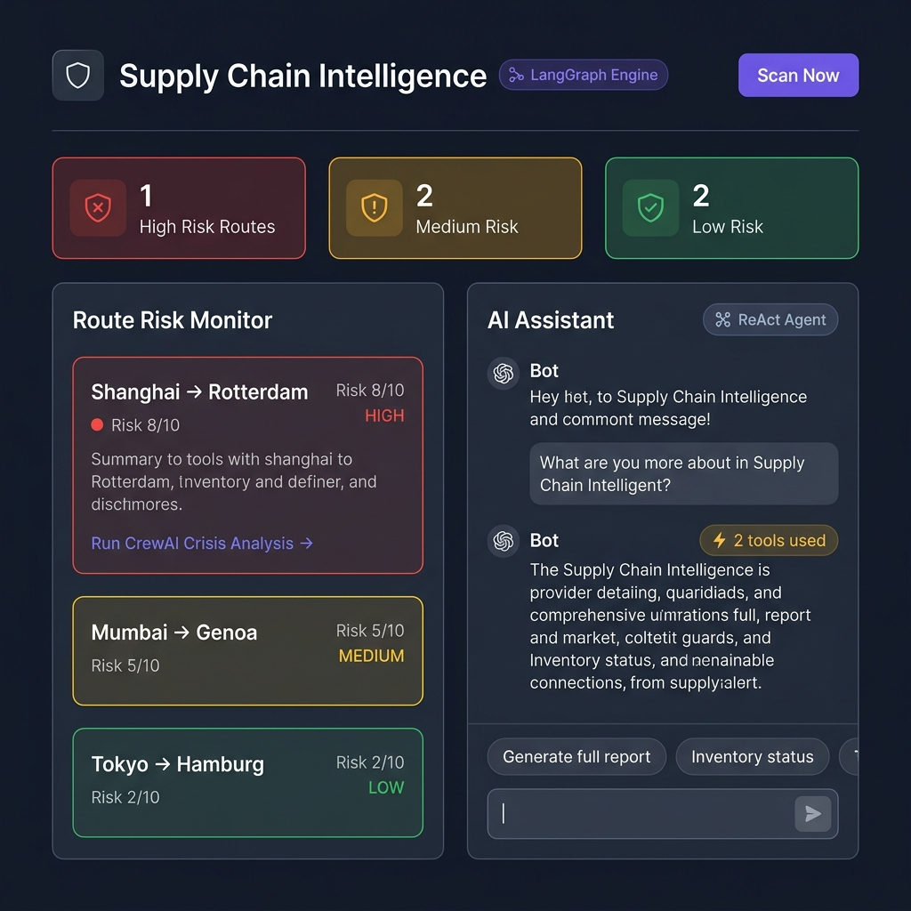

# LangGraph Implementation Report
## Smart Supply Chain Optimizer — Supply Chain Intelligence Module

**Proje:** Smart Supply Chain Optimizer  
**Modül:** Supply Chain Intelligence (Risk Monitoring + AI Chat Assistant)  
**Framework:** LangGraph v1.1.6 + LangChain v1.2.15  
**LLM:** Google Gemini 2.0 Flash (via `langchain-google-genai`)  
**Gözlemlenebilirlik:** LangSmith v0.7.30  
**Tarih:** Nisan 2026

---

## 1. Giriş ve Motivasyon

### 1.1 Problem Tanımı

Smart Supply Chain Optimizer projesinde mevcut CrewAI sistemi **reaktif** bir kriz çözümleme mekanizması sunmaktadır — yani bir kriz oluştuktan sonra devreye girerek müdahale planları üretmektedir. Ancak modern tedarik zinciri yönetiminde **proaktif** izleme ve erken uyarı sistemleri kritik öneme sahiptir. Bir krizi önlemek, bir krize müdahale etmekten her zaman daha az maliyetlidir.

### 1.2 LangGraph Seçim Gerekçesi

LangGraph, aşağıdaki teknik avantajları nedeniyle bu modül için tercih edilmiştir:

| Özellik | CrewAI (Mevcut) | LangGraph (Yeni) |
|---------|-----------------|-------------------|
| **Kontrol akışı** | Örtük (framework yönetir) | Açık (geliştirici graf çizer) |
| **Dallanma** | Sıralı pipeline | Koşullu kenarlar (conditional edges) |
| **Döngü** | Desteklemez | Doğal destek (ReAct loop) |
| **Durum yönetimi** | Agent context | TypedDict state schema |
| **Araç çağrısı** | Agent kendi karar verir | Hem otomatik hem kontrollü |
| **Gözlemlenebilirlik** | Kendi logları | LangSmith entegrasyonu (otomatik) |
| **Determinizm** | Düşük (LLM-bağımlı) | Yüksek (graf topolojisi sabit) |

### 1.3 Mimari Felsefe: İki Sistem, Bir Platform

```
CrewAI  → "Yangın söndürücü" — Kriz olduktan sonra müdahale planı üretir
LangGraph → "Yangın dedektörü" — Kriz olmadan önce risk tarar ve uyarır
```

İki sistem birbirini **tamamlar**: LangGraph yüksek risk tespit edince, kullanıcıyı CrewAI kriz analizine yönlendirir. Bu, proaktif izleme → reaktif müdahale döngüsünü oluşturur.

---

## 2. Mimari Genel Bakış

### 2.1 Sistem Mimarisi



**Katmanlar:**
- **Frontend (Next.js):** `/monitoring` sayfası, split-panel UI, 3 API proxy route
- **Backend (FastAPI):** LangGraph Engine (Scan Graph + Chat Graph) ve CrewAI Engine yan yana
- **Araçlar:** 4 LangChain @tool fonksiyonu (Serper + Supabase)
- **Dış Servisler:** Supabase PostgreSQL, Google Gemini, SerperDev API, LangSmith

### 2.2 Dosya Yapısı

```
backend/src/supply_chain_graph/          ← YENİ LangGraph Paketi
├── __init__.py                          ← Paket başlatıcısı, run_risk_scan() ve run_chat() export
├── state.py                             ← ScanState ve ChatState TypedDict tanımları
├── models.py                            ← RouteRisk ve RiskScanResult Pydantic modelleri
├── tools_langchain.py                   ← 4 adet LangChain @tool fonksiyonu
└── graph.py                             ← 2 adet derlenmiş StateGraph + entry point fonksiyonları

backend/src/supply_chain_crew/           ← MEVCUT CrewAI Paketi (DEĞİŞTİRİLMEDİ)
├── crew.py                              ← SupplyChainCrew sınıfı
├── main.py                              ← CLI entry point + Supabase helpers
├── models.py                            ← Pydantic çıktı modelleri
├── tools.py                             ← SupabaseInventoryTool (CrewAI BaseTool)
└── config/
    ├── agents.yaml                      ← Agent tanımları
    └── tasks.yaml                       ← Görev pipeline tanımları
```

> **Önemli:** `supply_chain_crew/` altındaki hiçbir dosya değiştirilmemiştir. İki paket tamamen bağımsız çalışır.

---

## 3. LangGraph Temel Kavramları

### 3.1 State (Durum)

LangGraph'ta her graf çalışması bir **state** (durum) nesnesi üzerinden ilerler. State, grafın "belleği"dir — her düğüm state'i okur, işler ve günceller.

Projede iki farklı state şeması tanımlanmıştır:

#### ScanState — Risk İzleme Pipeline'ı İçin

```python
class ScanState(TypedDict):
    routes: list[str]                    # Taranacak rotalar
    raw_news: dict[str, str]             # Her rota için ham haber verisi
    risk_results: list[dict[str, Any]]   # Analiz edilmiş risk sonuçları
    scan_summary: str                    # Genel tarama özeti
```

**Veri akışı:**
```
routes: ["Shanghai→Rotterdam", "Mumbai→Genoa", ...]
    ↓ fetch_routes_node
raw_news: {"Shanghai→Rotterdam": "Reuters: Port delays...", ...}
    ↓ scan_news_node  
risk_results: [{"route": "Shanghai→Rotterdam", "risk_score": 8, ...}, ...]
    ↓ analyze_risks_node
scan_summary: "Scanned 5 routes: 1 high risk, 2 medium, 2 low."
    ↓ save_results_node
```

#### ChatState — AI Asistan İçin

```python
class ChatState(TypedDict):
    messages: Annotated[list[BaseMessage], add_messages]
```

Bu state, `add_messages` reducer fonksiyonu sayesinde her düğüm çağrısında otomatik olarak mesaj listesine ekleme yapar. Bu, LangChain'in standart mesaj tabanlı konuşma modelidir.

### 3.2 Nodes (Düğümler)

Düğümler, grafın hesaplama birimleridir — her biri state'i input olarak alır, işlem yapar ve state güncellemesi döndürür. Saf Python fonksiyonlarıdır.

### 3.3 Edges (Kenarlar)

Kenarlar, düğümler arasındaki geçişleri tanımlar:
- **Normal kenar:** `A → B` (koşulsuz, her zaman)
- **Koşullu kenar:** `A → B veya C` (state'e göre karar verilir)

### 3.4 Graph (Graf)

Düğümler ve kenarlar birleştirilerek bir `StateGraph` oluşturulur, ardından `.compile()` ile çalıştırılabilir hale getirilir. Derlenmiş graf, `.invoke()` veya `.stream()` ile tetiklenir.

---

## 4. Scan Graph — Risk İzleme Pipeline'ı

### 4.1 Topoloji



Bu, **linear (doğrusal) bir pipeline'dır** — her düğüm sırayla çalışır, dallanma yoktur.

`START → fetch_routes → scan_news → analyze_risks → save_results → END`

### 4.2 Düğüm İmplementasyonları

#### Node 1: `fetch_routes_node`

```python
def fetch_routes_node(state: ScanState) -> dict:
    routes = state.get("routes") or DEFAULT_ROUTES
    return {"routes": routes, "raw_news": {}, "risk_results": []}
```

**İşlev:** State'ten izlenecek rotaları okur. Eğer özel rota belirtilmemişse, 5 varsayılan global rota kullanılır:
- Shanghai → Rotterdam (via Red Sea)
- Mumbai → Genoa (via Suez Canal)
- Shenzhen → Los Angeles (Trans-Pacific)
- Tokyo → Hamburg (via Panama Canal)
- Singapore → Felixstowe (via Suez Canal)

**Girdi:** `routes` (opsiyonel)  
**Çıktı:** `routes`, `raw_news` (boş), `risk_results` (boş)

---

#### Node 2: `scan_news_node`

```python
def scan_news_node(state: ScanState) -> dict:
    routes = state["routes"]
    raw_news = {}
    for route in routes:
        search_query = f"{route} shipping disruption delay news {datetime.now().year}"
        result = search_supply_chain_news.invoke(search_query)
        raw_news[route] = result
    return {"raw_news": raw_news}
```

**İşlev:** Her rota için Serper API aracılığıyla Google'da haber araması yapar. Arama sorgusu, rota adı + "shipping disruption delay news" + güncel yıl şeklinde oluşturulur.

**Kullanılan Araç:** `search_supply_chain_news` (LangChain @tool)  
**Dış Servis:** SerperDev API  
**Girdi:** `routes` listesi  
**Çıktı:** `raw_news` — her rota için haber başlıkları ve snippet'ler  

**Örnek çıktı:**
```
"Shanghai → Rotterdam": "WEB SEARCH RESULTS:
- Reuters: Shanghai port faces 3-day delays amid congestion surge
- Bloomberg: Red Sea attacks continue to reroute 40% of container traffic
- TradeWinds: Maersk announces surcharges on Asia-Europe routes"
```

---

#### Node 3: `analyze_risks_node`

```python
def analyze_risks_node(state: ScanState) -> dict:
    llm = _get_llm(temperature=0.2)
    for route in routes:
        news_data = raw_news.get(route)
        prompt = f"Analyze news for {route}... provide JSON risk assessment..."
        response = llm.invoke([HumanMessage(content=prompt)])
        risk_data = json.loads(response.content)
        risk_results.append(risk_data)
    return {"risk_results": risk_results}
```

**İşlev:** Her rota için toplanan haberleri Google Gemini'ye gönderir. Gemini, haberleri analiz ederek yapılandırılmış bir risk değerlendirmesi üretir.

**LLM Parametreleri:**
- Model: `gemini-2.0-flash`
- Temperature: `0.2` (düşük — tutarlı ve deterministik sonuçlar için)

**Çıktı Şeması (JSON):**
```json
{
    "route": "Shanghai → Rotterdam (via Red Sea)",
    "risk_score": 8,
    "risk_category": "geopolitical",
    "summary": "Ongoing Houthi attacks in the Red Sea continue to disrupt...",
    "news_sources": ["Reuters: Red Sea...", "Bloomberg: Container..."],
    "confidence": "high",
    "recommended_action": "Consider activating crisis protocol"
}
```

**Risk Skoru Anlamları:**

| Skor | Seviye | Anlam |
|------|--------|-------|
| 1-3 | 🟢 LOW | Normal operasyonlar, risk yok |
| 4-6 | 🟡 MEDIUM | Dikkat gerekli, olası gecikmeler |
| 7-8 | 🔴 HIGH | Aktif kesinti, alternatif rotalama önerilir |
| 9-10 | 🔴 CRITICAL | Tam durma riski, acil müdahale gerekli |

---

#### Node 4: `save_results_node`

```python
def save_results_node(state: ScanState) -> dict:
    supabase = _get_supabase()
    for r in risk_results:
        supabase.table("risk_scans").insert({...}).execute()
    return {"scan_summary": summary}
```

**İşlev:** Analiz sonuçlarını Supabase `risk_scans` tablosuna kaydeder ve genel bir özet üretir.

**Veritabanı İşlemi:** Her rota için ayrı bir INSERT sorgusu  
**Çıktı:** `scan_summary` — ör: "Scanned 5 routes: 1 high risk, 2 medium, 2 low. Overall status: ALERT."

### 4.3 Graf Derleme Kodu

```python
def _build_scan_graph():
    builder = StateGraph(ScanState)
    
    builder.add_node("fetch_routes", fetch_routes_node)
    builder.add_node("scan_news", scan_news_node)
    builder.add_node("analyze_risks", analyze_risks_node)
    builder.add_node("save_results", save_results_node)
    
    builder.add_edge(START, "fetch_routes")
    builder.add_edge("fetch_routes", "scan_news")
    builder.add_edge("scan_news", "analyze_risks")
    builder.add_edge("analyze_risks", "save_results")
    builder.add_edge("save_results", END)
    
    return builder.compile()

scan_graph = _build_scan_graph()
```

---

## 5. Chat Graph — ReAct Konuşma Ajanı

### 5.1 Topoloji



Bu, **döngüsel bir ReAct (Reason + Act) desenidir.** CrewAI'dan temel farkı budur — agent düşünür, araç kullanır, tekrar düşünür, gerekirse başka araç kullanır, ta ki tatmin edici bir cevap üretene kadar.

### 5.2 ReAct Döngüsü Detaylı Akışı

```
1. Kullanıcı mesajı gelir
2. agent_node: Gemini'ye tools bağlı şekilde gönderilir
3. Gemini karar verir: "Araç kullanmam lazım mı?"
   3a. EVET → tool_calls üretir → tools node'una git
       → tools node aracı çalıştırır → sonuç state'e eklenir
       → agent_node'a geri dön (DÖNGÜ)
   3b. HAYIR → doğrudan metin cevabı üretir → END
4. Cevap kullanıcıya döner
```

**Somut Örnek — "Envanter durumu ne?" sorusu:**
```
Kullanıcı: "Envanter durumu ne?"
    ↓
agent_node: Gemini düşünür → "query_inventory aracını çağırmalıyım"
    → tool_calls: [{"name": "query_inventory", "args": {}}]
    ↓
tools node: query_inventory() çalışır
    → Supabase'den stok verisi çekilir
    → ToolMessage: "Li-Ion Battery: 45000 units, 5.3 days..."
    ↓
agent_node: Gemini sonucu okur → cevap üretir (tool_calls yok)
    → "Mevcut envanter durumu: Li-Ion Battery 5.3 gün kaldı (KRİTİK)..."
    ↓
END → Kullanıcıya cevap döner
```

**Çoklu Araç Kullanım Örneği — "Tam rapor üret":**
```
Kullanıcı: "Generate full supply chain report"
    ↓
agent_node → tool_calls: [query_inventory]
    ↓ tools → agent
agent_node → tool_calls: [get_latest_risk_scan]
    ↓ tools → agent
agent_node → tool_calls: [query_crisis_history]
    ↓ tools → agent
agent_node → tool_calls: [search_supply_chain_news]
    ↓ tools → agent
agent_node → final response (yapılandırılmış markdown rapor)
    ↓
END
```

Bu örnekte agent, **4 farklı aracı sırayla** çağırır ve tüm sonuçları birleştirerek kapsamlı bir rapor üretir.

### 5.3 Koşullu Kenar (Conditional Edge)

```python
def should_continue(state: ChatState) -> str:
    last_message = state["messages"][-1]
    if hasattr(last_message, "tool_calls") and last_message.tool_calls:
        return "tools"
    return END
```

Bu fonksiyon, agent düğümünden sonra grafın nereye gideceğini belirler. `tool_calls` varsa döngüye devam eder, yoksa sona gider. Bu, LangGraph'ın en güçlü özelliğidir — akış kontrolü tamamen geliştiricinin elindedir.

### 5.4 Graf Derleme Kodu

```python
def _build_chat_graph():
    builder = StateGraph(ChatState)
    
    builder.add_node("agent", agent_node)
    builder.add_node("tools", ToolNode(ALL_CHAT_TOOLS))
    
    builder.add_edge(START, "agent")
    builder.add_conditional_edges(
        "agent", should_continue, 
        {"tools": "tools", END: END}
    )
    builder.add_edge("tools", "agent")  # Döngü: araç sonrası tekrar düşün
    
    return builder.compile()

chat_graph = _build_chat_graph()
```

---

## 6. LangChain Araçları (Tools)

### 6.1 Araç Mimarisi



LangGraph, `@tool` dekoratörü ile tanımlanan LangChain araçlarını kullanır. Bu araçlar, CrewAI'daki `BaseTool` sınıfından tamamen bağımsızdır.

### 6.2 Araç Detayları

#### `search_supply_chain_news(query: str) → str`

| Özellik | Detay |
|---------|-------|
| **Amaç** | Web'de tedarik zinciri haberleri aramak |
| **API** | SerperDev Google Search API |
| **Endpoint** | `POST https://google.serper.dev/search` |
| **Sonuç** | İlk 5 organik sonucun başlık + snippet + URL'si |
| **Timeout** | 10 saniye |
| **Kullanıcılar** | Scan Graph (Node 2) + Chat Graph (isteğe bağlı) |

#### `query_inventory() → str`

| Özellik | Detay |
|---------|-------|
| **Amaç** | Supabase'den canlı envanter verisi çekmek |
| **Tablo** | `inventory` |
| **Hesaplama** | `days_left = current_stock / daily_burn_rate` |
| **Durum eşikleri** | <7 gün: CRITICAL, <14 gün: WARNING, ≥14 gün: OK |
| **Kullanıcılar** | Chat Graph |

#### `query_crisis_history() → str`

| Özellik | Detay |
|---------|-------|
| **Amaç** | Geçmiş CrewAI kriz analizlerini sorgulamak |
| **Tablolar** | `crisis_runs` + `mitigation_plans` (JOIN) |
| **Limit** | Son 5 kriz çalışması |
| **Kullanıcılar** | Chat Graph |

#### `get_latest_risk_scan() → str`

| Özellik | Detay |
|---------|-------|
| **Amaç** | Son risk tarama sonuçlarını getirmek |
| **Tablo** | `risk_scans` |
| **Limit** | Son 10 tarama kaydı |
| **Kullanıcılar** | Chat Graph |

---

## 7. Veritabanı Şeması

### 7.1 Yeni Tablo: `risk_scans`



```sql
CREATE TABLE risk_scans (
    id UUID DEFAULT gen_random_uuid() PRIMARY KEY,
    route TEXT NOT NULL,
    risk_score INTEGER NOT NULL CHECK (risk_score BETWEEN 0 AND 10),
    risk_category TEXT NOT NULL DEFAULT 'none',
    summary TEXT NOT NULL DEFAULT '',
    news_sources TEXT[] DEFAULT '{}',
    confidence TEXT DEFAULT 'low',
    recommended_action TEXT DEFAULT '',
    scanned_at TIMESTAMPTZ DEFAULT now()
);
```

**Güvenlik:** Row Level Security (RLS) aktif — public SELECT + service INSERT.  
**Indexleme:** `scanned_at DESC` ve `risk_score DESC` üzerinde indexler.  
**Realtime:** `supabase_realtime` publication'a eklenmiş.

### 7.2 Mevcut Tablolarla İlişki

`risk_scans` tablosu mevcut tablolarla doğrudan foreign key ilişkisi **yoktur**. İlişki, uygulama seviyesinde (LangGraph araçları aracılığıyla) sağlanır. LangGraph chat ajanı, `query_inventory` ve `query_crisis_history` araçları vasıtasıyla mevcut `inventory` ve `crisis_runs` tablolarını sorgulayabilir.

---

## 8. LangSmith Entegrasyonu (Gözlemlenebilirlik)

### 8.1 Konfigürasyon

LangSmith, sadece ortam değişkenleri ile otomatik olarak etkinleşir:

```env
LANGCHAIN_TRACING_V2=true
LANGCHAIN_API_KEY=lsv2_pt_...
LANGCHAIN_PROJECT=smart-supply-chain-optimizer
```

### 8.2 Otomatik İzlenen Metrikler

LangSmith, aşağıdaki verileri **hiçbir ek kod yazmadan** otomatik olarak toplar:

| Metrik | Açıklama |
|--------|----------|
| **Node execution traces** | Her düğümün çalışma süresi ve girdi/çıktısı |
| **LLM calls** | Gemini'ye gönderilen prompt ve alınan cevap |
| **Tool calls** | Hangi araçlar çağrıldı, ne döndü |
| **Token usage** | Input/output token sayıları |
| **Latency** | Her adımın milisaniye cinsinden süresi |
| **Error traces** | Hata durumlarında tam stack trace |

### 8.3 Debug Senaryoları

LangSmith dashboard'unda şunlar görülebilir:
- Agent neden o aracı seçti?
- Gemini cevabı neden uzun sürdü?
- Serper araması hangi sonuçları döndürdü?
- Supabase sorgusu başarılı mı?

Bu bilgiler, production'da hata ayıklama ve performance optimizasyonu için kritik öneme sahiptir.

---

## 9. FastAPI Endpoint'leri

### 9.1 Yeni Endpoint'ler

Mevcut CrewAI endpoint'i (`POST /api/analyze-crisis`) **değiştirilmeden**, 3 yeni endpoint eklenmiştir:

#### `POST /api/langgraph/scan`

| Parametre | Tip | Zorunlu | Açıklama |
|-----------|-----|---------|----------|
| `routes` | `list[str]` | Hayır | Taranacak rotalar (varsayılan: 5 global rota) |

**Yanıt:** `scan_summary`, `risk_results[]`, `routes_scanned`

#### `POST /api/langgraph/chat`

| Parametre | Tip | Zorunlu | Açıklama |
|-----------|-----|---------|----------|
| `message` | `str` | Evet | Kullanıcı mesajı |
| `history` | `list[dict]` | Hayır | Önceki mesaj geçmişi |

**Yanıt:** `response` (AI cevabı), `tool_calls_made` (kullanılan araç sayısı)

#### `GET /api/langgraph/scans`

**Yanıt:** `scans[]` — son 20 risk tarama kaydı

---

## 10. Frontend Entegrasyonu

### 10.1 Monitoring Sayfası (`/monitoring`)



Sayfa, bölünmüş panel (split-panel) tasarımı kullanır:

**Sol Panel — Route Risk Monitor:**
- Risk skoruna göre 🔴🟡🟢 renk kodlanmış kartlar
- Yüksek risk (score ≥ 7) olan rotalarda "Run CrewAI Crisis Analysis →" linki
- Gerçek zamanlı tarama sonuçları

**Sağ Panel — AI Chat Assistant:**
- ReAct agent loop ile konuşma arayüzü
- Araç kullanım göstergesi (⚡ tools used)
- Öneri butonları: "Generate full report", "Inventory status", "Latest risk scan"

### 10.2 Önemli UI Özellikleri

- **Risk kartları:** Risk skoruna göre 🔴🟡🟢 renk kodlaması ve animasyonlu dot göstergesi
- **CrewAI köprüsü:** Score ≥ 7 olan rotalarda "Run CrewAI Crisis Analysis →" linki
- **Chat araç göstergesi:** Agent araç kullandığında "⚡ 3 tools used" etiketi
- **Otomatik rapor:** "Generate full report" komutuyla 4 aracı sırayla çağırıp executive rapor üretme
- **Gerçek zamanlı loading:** "Thinking & querying tools..." animasyonu

---

## 11. CrewAI ile LangGraph Karşılaştırması

### 11.1 Teknik Karşılaştırma

| Özellik | CrewAI | LangGraph |
|---------|--------|-----------|
| **Paradigma** | Agent Role-Playing | State Machine Graph |
| **Konfigürasyon** | YAML (agents.yaml, tasks.yaml) | Python kodu (StateGraph API) |
| **LLM çağrısı** | Framework yönetir | Geliştirici kontrol eder |
| **Araç bağlama** | `BaseTool` sınıfı | `@tool` dekoratörü |
| **Çıktı formatı** | `output_pydantic` parametresi | JSON parse veya `with_structured_output()` |
| **Hata yönetimi** | Framework seviyesi | Düğüm seviyesinde try/catch |
| **Döngü** | Desteklemez | Koşullu kenarla doğal destek |
| **Gözlemlenebilirlik** | Console log | LangSmith (tam trace) |
| **Determinizm** | Düşük | Yüksek (graf topolojisi sabit) |

### 11.2 Bu Projede Roller

| Konu | CrewAI Rolü | LangGraph Rolü |
|------|------------|----------------|
| **Tetikleme** | Manuel — kullanıcı kriz tanımlar | Hem otomatik (scan) hem konuşma (chat) |
| **Amaç** | Kriz müdahale planları üretmek | Erken uyarı + veri keşfi + raporlama |
| **Çıktı** | 3 yapılandırılmış plan (Plan A, B, C) | Risk skorları + sohbet cevapları + raporlar |
| **Sayfa** | `/crisis` | `/monitoring` |
| **Tablo** | `crisis_runs` + `mitigation_plans` | `risk_scans` |

---

## 12. Bağımlılıklar

### 12.1 Yeni Python Paketleri

| Paket | Versiyon | Amaç |
|-------|----------|------|
| `langgraph` | 1.1.6 | StateGraph framework |
| `langchain` | 1.2.15 | LLM abstraction layer |
| `langchain-google-genai` | 4.2.1 | Gemini bağlantısı |
| `langchain-community` | 0.4.1 | Community tools |
| `langsmith` | 0.7.30 | Otomatik tracing |
| `requests` | 2.31+ | Serper API HTTP çağrıları |

### 12.2 Mevcut Paketlerle Uyum

Mevcut `crewai[tools,google-genai]` paketi korunmuştur. İki framework aynı Python venv'de sorunsuz çalışır çünkü:
- Ortak bağımlılıkları paylaşırlar (`pydantic`, `google-generativeai`)
- Farklı import path'leri kullanırlar (`crewai.*` vs `langgraph.*`)
- Farklı API endpoint'lerinden tetiklenirler

---

## 13. Sonuç

Bu implementasyon, Smart Supply Chain Optimizer projesine LangGraph'ı **tamamlayıcı** bir sistem olarak entegre etmiştir. Mevcut CrewAI altyapısına dokunmadan, projeye şu yetenekler kazandırılmıştır:

1. **Proaktif Risk İzleme** — 5 global rota için web tabanlı haber taraması ve AI risk skorlaması
2. **Konuşma Tabanlı AI Asistan** — ReAct döngüsüyle 4 farklı aracı otomatik kullanan sohbet botu
3. **Otomatik Rapor Üretimi** — Tüm veri kaynaklarını birleştiren executive rapor
4. **LangSmith Gözlemlenebilirliği** — Her LLM çağrısı ve araç kullanımının otomatik kaydı
5. **CrewAI Entegrasyon Köprüsü** — Yüksek riskli rotalar için tek tıkla kriz analizi tetikleme

Bu çift motorlu mimari (CrewAI + LangGraph), modern yapay zeka mühendisliğinde **Multi-Agent Orchestration** yaklaşımının iki farklı paradigmasını tek bir platformda sergilemektedir.

---

*Rapor Sonu — Smart Supply Chain Optimizer, Nisan 2026*
